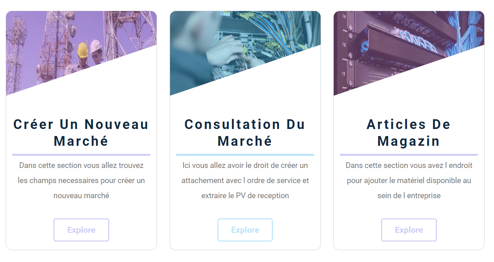
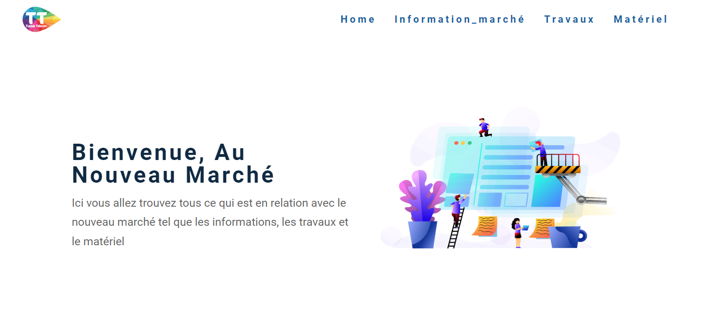

# Project: Monthly Attachments Management for MT1 Markets

The goal of this project is to develop an application that manages the monthly attachments for MT1 markets. The intern is responsible for the following tasks:

- Retrieve store articles.
- Retrieve payment articles.
- Study the project requirements.
- Prepare a database.
- Develop a web application and test access.

## Application Features

- Management of monthly attachments for MT1 markets.
- Retrieval of store articles and associated payments.
- Data storage in a database.
- User-friendly interface for accessing and managing attachments.

## Frontend

The frontend part of this project is responsible for providing a user-friendly interface for accessing and managing the attachments. It is developed using modern web technologies, including HTML, CSS, and JavaScript.

### Technologies Used

- HTML5, CSS3, JavaScript
- React.js: A JavaScript library for building user interfaces
- React Router: A library for routing in a React application

You can customize and extend the frontend components and pages to fit your specific requirements.

### Screenshots

Here are some screenshots of the frontend interface:

